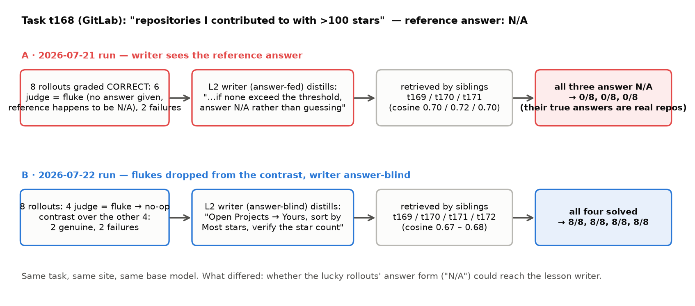

# 评测研究："Is the surprise judge reliable?"——人工审计包、稳定性测试与案例（2026-09-23）

这份文档是给活人打分用的材料包加最终报告的骨架。判官（judge）是我们写端的第一道门：官方判分器说"对"之后，它负责区分**真做对（genuine）**和**蒙对（fluke）**，蒙对的 rollout 不写 L1、也从 L2 的对比里剔除。审计要回答的是：它标的"蒙对"是不是真的蒙对（precision），真蒙对的它漏了多少（recall），同一份输入它自己判几次是否一致（稳定性），以及一条蒙对若没被拦住会怎样（案例）。

**先说清楚一个映射。** 任务书写的是"4 个模型各抽 50 条"。我们的 WebArena 判官只有一个模型（gpt-5.6-sol，与 agent 同模型），没有四个判官模型的实跑数据；SWE 的判官是另一套（gpt-4o-mini，判 success/verified，没有 fluke 标签），Mind2Web 没有本机数据。所以抽样按**五个任务场景（站）各 40 条**分层，共 200 条，主表按站分行；"多模型"放在稳定性测试里——同一批输入换四个判官模型各判 5 次，模型名由你定，脚本已参数化。

## 一、抽样（已完成）

总体 = 五站全集配对 run 里官方判分器判"对"的全部 rollout（两臂都算），共 7,937 条，其中判官标 fluke 412 条（5.2%）。每站随机抽 20 条判官标 fluke + 20 条判官标 genuine（seed 0），既有正常成功也有蒙对，且蒙对被有意超采（总体里只有 5%，随机抽 200 条只会有 10 条蒙对，算不出 recall）。

| 站 | 官方判对的 rollout 里 judge=genuine | judge=fluke | 抽样 genuine | 抽样 fluke |
|---|---|---|---|---|
| shopping | 1599 | 99 | 20 | 20 |
| shopping_admin | 1815 | 44 | 20 | 20 |
| gitlab | 2000 | 103 | 20 | 20 |
| reddit | 1252 | 26 | 20 | 20 |
| map | 859 | 140 | 20 | 20 |
| 合计 | 7525 | 412 | 100 | 100 |

文件（`judge_audit/`）：
- `sample_200.jsonl`：每条的完整记录——站、run、臂、题号、模板、题目、参考答案、官方结果、agent 最终答案、逐步轨迹（每步的思考 / 动作 / URL）、判官标签与理由。
- `annotation_sheet.csv`：**给标注者的表，判官标签和理由已隐藏**；每行是题目、参考答案、官方结果、agent 最终答案、步数、轨迹文本，最后四列 `A_label / A_evidence / B_label / B_evidence` 留给两位标注者独立填写。
- `answer_key.csv`：判官标签与理由，评分时才合并。
- `sampling_table.md`：上面那张抽样表。

轨迹里没有页面文本（fleet run 没有保存 judge 读的 compact_trace，只有每步的思考、动作和 URL），标注者看到的比判官当时看到的少一层证据；标"蒙对"时要求写出依据，就是为了让"有明确错误依据"这一档站得住。

## 二、人工标注规则（两人独立、盲判）

每条只看题目、参考答案、agent 的最终答案和轨迹，标三档之一：

| 标签 | 填写 | 判据 |
|---|---|---|
| 正常成功 | `genuine` | 轨迹里确实走到并读到了支撑答案的页面/数值，答案由此得出 |
| 有明确错误依据的蒙对 | `fluke` | 答案对了但轨迹不支撑：没走到相关页面就作答；把一大段页面内容倒进答案恰好包含正确值；参考答案是 N/A 或退化值而 agent 只是没作答、空答或放弃；靠猜或靠默认值命中；数值/名字来自无关页面。**必须在 evidence 列写出具体依据**（哪一步、缺了什么） |
| 无法判断 | `unsure` | 轨迹信息不足以判定（例如关键页面内容没记录），或两种解释都成立 |

规则：不看判官标签；不互相讨论；先各标完再合并。A、B 一致的才进 precision / recall 的分母；分歧和 `unsure` 单列报告数量。评分脚本 `scripts/judge_audit_score.py` 直接读两张表，输出下面主表。

## 三、主表（待填）

| 站 | 标注样本 | A/B 一致 | κ | 无法判断/分歧（剔除） | judge 判蒙对 | 人判蒙对 | 都判蒙对 | precision | recall |
|---|---|---|---|---|---|---|---|---|---|
| shopping | 40 | | | | 20 | | | | |
| shopping_admin | 40 | | | | 20 | | | | |
| gitlab | 40 | | | | 20 | | | | |
| reddit | 40 | | | | 20 | | | | |
| map | 40 | | | | 20 | | | | |
| 合计 | 200 | | | | 100 | | | | |

precision = 判官标蒙对且人也标蒙对 / 判官标蒙对；recall = 两者都标蒙对 / 人标蒙对。注意 recall 的分母来自一个"判官 genuine 里随机 20 条 + 判官 fluke 20 条"的分层样本，不是总体比例——报告时要按总体里 fluke 5.2% / genuine 94.8% 的权重换算，脚本里给出未加权和加权两个数。若某站人判蒙对少于 10 条，按任务书"再补充审计"：`judge_audit_sample.py` 的 `PER` 调大即可，seed 不变时前 20 条不动。

## 四、稳定性测试（要网关，未跑）

每站从上面的样本里取 10 条（5 判官 fluke + 5 判官 genuine），用实验里原来的判官提示词和配置（`WaBrain.judge_trajectory`，temperature 0），对同一份输入重复判 5 次，统计五次全一致的比例、多数票与原标签一致的比例。脚本 `scripts/judge_stability_test.py --models gpt-5.6-sol,<模型2>,<模型3>,<模型4> --repeats 5`，结果写 `judge_audit/stability_results.json`。

| 判官模型 | n | 五次全一致 | 多数票 = 原标签 | 平均多数票占比 |
|---|---|---|---|---|
| gpt-5.6-sol（实验用） | 50 | | | |
| （模型 2） | 50 | | | |
| （模型 3） | 50 | | | |
| （模型 4） | 50 | | | |

限制要写进论文：fleet run 没有保存判官当时读的完整 compact_trace（含页面文本），脚本用记录下来的每步思考 / 动作 / URL 加最终答案重建输入，所以测的是"缩减轨迹上的稳定性"。要在原始输入上测，需要重跑这 50 道题的 rollout 拿到完整轨迹（机群 + 网关）。

## 五、案例：一条蒙对怎样变成毒经验，又怎样被拦住



任务 t168（GitLab）："Tell me the full names of the repositories where I made contributions and they got more than 100 stars?" 参考答案是 **N/A**——这个账号没有任何符合条件的仓库。它的四道同模板兄弟题 t169–t172 只是把条件换了（星数阈值、贡献类型），答案都是真实的仓库名。

**A · 07-21 22:07 那次 run（`wa_gitlab_20260721_220729`，写手能看到参考答案）。** t168 的 8 条 rollout 里 6 条被官方判对——判官把这 6 条全标成 fluke：agent 根本没有作答（页面空了就停），而参考答案恰好是 N/A，模糊匹配放过；另 2 条失败。L2 按全错档从那 2 条失败里提炼，但提示词里带着 `REFERENCE ANSWER: N/A`，于是写出经验 **«Verify contributed projects and star thresholds before answering»**，content 末尾一句："if none visibly exceed the threshold, **answer N/A** rather than guessing from familiar names"。这条经验的 description 写的是通用条件（"contributed to + star-count condition"），t169、t170、t171 的检索都命中它（余弦 0.701 / 0.716 / 0.697，LLM 门控也选了它），三道题 8 条 rollout 全部照做——跑到空的 Contributed 页、答 N/A——**0/8、0/8、0/8**；t172 取到的是另一条经验，5/8。

**B · 07-22 那次 run（`wa_gitlab_20260722_022526`，蒙对 no-op + 写手答案盲）。** 同一道 t168：8 条里 4 条判官标 fluke，剔出对比；剩下 4 条（2 真成功、2 失败）按半对半错档提炼，写手看不到参考答案，写出的是 **«Verify contributed projects by actual star count»**："Open Projects → Yours, select Most stars, verify which metric is the star count… the failing rollouts guessed from prominent names without verifying stars"。t169–t172 检索到它（余弦 0.67–0.68），**8/8、8/8、8/8、8/8**。

**怎么读这个案例。** 两次 run 里判官都正确识别了蒙对（6/6、4/4 的"没作答但被判对"），差别在蒙对的答案形态能不能进写手：A 里它经参考答案进了，B 里被挡在外面。所以它证明的是机制——**蒙对的 rollout 若以任何通道影响写端，写出的经验会把"退化答案"当规律，毒害整族兄弟题**——而不是整体收益；后者要看 PAPER_DIRECTION_REVIEW 的分档统计（全错档 +0.2、多数对档 +5.7）。"删除这条经验后的表现"这里就是 B：同题同站同模型，没有那条经验，四道题从 0/8 回到 8/8；严格说 B 还叠加了写手答案盲这一改动，不是单纯删除。

## 附录 A · 判官提示词（`src/hippo/wa/brain.py`，实验原文）

```
An agent attempted a web task. The OFFICIAL grader has ALREADY scored this rollout against the reference answer — that CORRECT/INCORRECT verdict (given in the message) is GROUND TRUTH; do NOT re-judge whether the final answer matches.
Your only job is to read the trace and label HOW the outcome came about.
Respond JSON {"outcome": str, "reason": str}:
- If the grader says INCORRECT -> outcome="failure"; reason = the concrete cause it went wrong and what it would have needed to do to reach the reference answer.
- If the grader says CORRECT -> decide how the right answer was reached:
    outcome="genuine" if the trace shows the agent actually navigated to and READ the value(s) that yield the reference answer;
    outcome="fluke" if the correct answer was reached by luck — the agent dumped/listed a lot of content that merely happened to contain it, guessed, or never grounded the specific value. reason = why it is a fluke.
- When the grader says CORRECT but you are unsure how, prefer "genuine".
```

用户消息格式：`TASK: …` / `REFERENCE ANSWER (ground truth): …` / `OFFICIAL GRADER VERDICT: CORRECT|INCORRECT` / `AGENT FINAL ANSWER: …` / `TRACE: …`，temperature 0，输出 JSON `{"outcome","reason"}`；代码层硬保证：判分器说错 → failure，说对 → 只能是 genuine 或 fluke，解析失败默认 genuine。

## 附录 B · 文件与脚本

| 文件 | 内容 |
|---|---|
| `judge_audit/sample_200.jsonl` | 200 条完整记录 |
| `judge_audit/annotation_sheet.csv` | 盲标表（判官标签隐藏） |
| `judge_audit/answer_key.csv` | 判官标签与理由 |
| `judge_audit/sampling_table.md` | 抽样表 |
| `scripts/judge_audit_sample.py` | 抽样脚本（seed 0，`PER` 可调大补样） |
| `scripts/judge_audit_score.py` | 标完后算主表：一致率、κ、precision、recall |
| `scripts/judge_stability_test.py` | 稳定性测试（要网关） |
| `paper/figures/C1_fluke_poison_case.png/.pdf` | 案例图 |

## 附录 C · 已知的判官行为（供标注者参考，不是标注依据）

- 判官从不推翻官方判分器；它只解释"怎么对的"。
- 蒙对在总体里占官方判对 rollout 的 5.2%，map 最高（14%），reddit 最低（2%）。
- 把蒙对当成功会改变 14/763 道题的写入决策；53 道题含至少一条蒙对，其中 24 次 L2 写入的源任务含蒙对（已剔出对比）。
- 判官的理由会带出评分口径（如"该把运费摊进去"），这是设计里声明过的泄漏通道；标注时如果发现判官理由与轨迹不符，记在 evidence 里。
